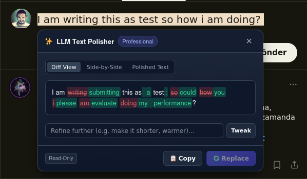
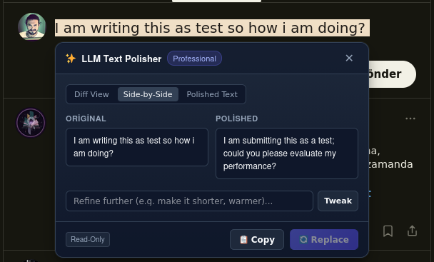
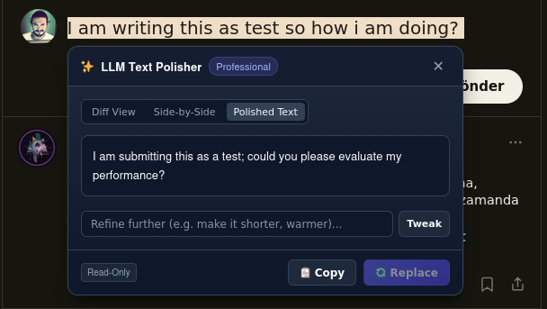

# LLM Text Polisher ✍️✨

[](https://opensource.org/licenses/MIT)
[](https://github.com/delirehberi/ai-polish-text/releases)
[](https://delirehberi.github.io/ai-polish-text/)
[](https://addons.mozilla.org/en-US/firefox/addon/ai-text-polisher/)

**LLM Text Polisher** is a cross-browser (Chrome & Firefox) Manifest V3 browser extension that allows you to select text anywhere on the web, right-click (or press `Alt+P`), and polish it using customizable LLM endpoints (OpenAI, Anthropic Claude, Ollama, Groq, Together AI, vLLM, LM Studio, etc.).

🦊 **Get it for Firefox:** [addons.mozilla.org/firefox/addon/ai-text-polisher](https://addons.mozilla.org/en-US/firefox/addon/ai-text-polisher/)

🌐 **Try the Live Interactive Demo:** [https://delirehberi.github.io/ai-polish-text/](https://delirehberi.github.io/ai-polish-text/)

---

## Visual Showcase

### 1. Inline Word-Level Diff View
Compare original text vs. polished text with highlighted word-level insertions and deletions.



### 2. Side-by-Side Comparison
Side-by-side columnar view showing the original draft alongside the AI-polished output.



### 3. Clean Polished Output & Tweak Refinement
Refine outputs dynamically with follow-up instructions (*"Make it shorter"*, *"Add warmth"*, *"Translate into French"*).



---

## Features

- 🎭 **Dynamic Tones & Styles:**
  - *Professional / Business*
  - *Casual / Friendly*
  - *Concise / Shorten*
  - *Academic / Formal*
  - *Grammar & Clarity Fix Only*
  - *Custom Prompt…* (inline prompt builder)
- 🔌 **Multi-Provider Support:**
  - **OpenAI** (`gpt-4o`, `gpt-4o-mini`, `o3-mini`, etc.)
  - **Anthropic Claude** (`claude-3-5-sonnet-20241022`, `claude-3-5-haiku-20241022`, etc.)
  - **Ollama** (Local self-hosted models like `llama3.2`, `mistral`, `deepseek-r1` — no API key needed)
  - **Custom OpenAI-Compatible** (Groq, Together AI, vLLM, OpenRouter, LM Studio)
- 🛡️ **Shadow DOM Style Isolation:**
  - Floating card UI is mounted in an isolated Open Shadow Root so host webpage CSS never breaks or distorts the extension UI.
- 🔄 **Smart In-Place Replacement:**
  - Automatically replaces selection inside form inputs, textareas, and modern rich-text editors (X / Twitter, Slack, Gmail, Notion, DraftJS, Lexical, ProseMirror) while preserving browser Undo/Redo history (`Ctrl+Z`).
  - Read-only pages automatically default to 1-click **Copy to Clipboard**.
- 💬 **Iterative Refinement (Tweak):**
  - Follow-up input box allows you to refine results incrementally without restarting the workflow.
- ⚡ **Global Keyboard Shortcut:**
  - Press `Alt+P` (`Option+P` on macOS) to instantly polish your selection with your default tone.

---

## Installation & Setup

### Install from Marketplaces
- 🦊 **Firefox:** [Firefox Add-ons (AMO)](https://addons.mozilla.org/en-US/firefox/addon/ai-text-polisher/) — approved by Mozilla ✅
- 🌐 **Chrome:** Chrome Web Store *(coming soon — use [Manual Installation](#manual-installation-unpacked) in the meantime)*

---

### Manual Installation (Unpacked)

#### For Google Chrome / Chromium (Brave, Edge, Arc)
1. Download `chrome.zip` from [Latest Releases](https://github.com/delirehberi/ai-polish-text/releases) or build locally with `make pack`.
2. Extract the archive (or use `dist/chrome`).
3. Open `chrome://extensions/` in your browser.
4. Toggle on **Developer mode** in the top-right corner.
5. Click **Load unpacked** and select the `dist/chrome` folder.
6. Open the extension Settings, configure your LLM provider & API key, and click **⚡ Test Connection**.

#### For Mozilla Firefox
> **Tip:** The easiest way is to install from [Firefox Add-ons](https://addons.mozilla.org/en-US/firefox/addon/ai-text-polisher/). The steps below load a temporary add-on for development/testing.

1. Download `firefox.zip` from [Latest Releases](https://github.com/delirehberi/ai-polish-text/releases) or build locally with `make pack`.
2. Open `about:debugging#/runtime/this-firefox` in Firefox.
3. Click **Load Temporary Add-on…** and select `dist/firefox/manifest.json`.

---

## Development & Build Automation

Run tasks via `make`:

```bash
# Build browser-specific dist folders (dist/chrome and dist/firefox)
make build

# Package dist/chrome.zip and dist/firefox.zip
make pack

# Run automated unit and open-source readiness tests
make test

# Verify JavaScript syntax across all files
make lint

# Bump version and rebuild packages
make version-patch   # e.g. 0.0.1 -> 0.0.2
make version-minor   # e.g. 0.0.1 -> 0.1.0
make version-major   # e.g. 0.0.1 -> 1.0.0
make version v=1.2.0 # set explicit version
```

---

## Support & Donate ⚡

If you find **LLM Text Polisher** useful, consider supporting its development:

- ⚡ **Bitcoin / Lightning (LNURL):** `delirehberi@emre.xyz`
- 🌐 **Website:** [emre.xyz](https://emre.xyz)
- 🟣 **Nostr:** [nostr.emre.xyz](https://nostr.emre.xyz)

---

## License

MIT License © 2026 [Emre Yılmaz](https://emre.xyz). Built with open-source standards.
